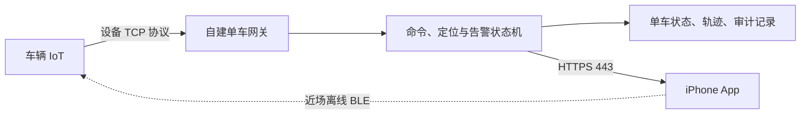

# 电助力山地车远程控制需求与方案

> 历史文档：远程服务已于 2026 年 8 月 23 日停止并完成远端资产永久清理。当前产品为 Build 26 纯 BLE App，本文只保留此前需求与实车证据，不代表待恢复的产品计划。

## 1. 文档目的

本文件是指定测试车辆的需求基线。当前已进入分阶段实车验证，协议事实、代码实现和实车结果必须分开记录。产品界面统一使用“车辆”或“电助力山地车”，仅在引用厂商协议时保留“滑板车”字段名。

## 2. 已确认范围

- 仅支持一台指定车辆和一台 iPhone，App 通过免费 Personal Team 用 Xcode 真机安装。
- BLE 近场模式必须完全离线可用，远程模式经自建单车网关提供位置、找车、远程开关锁、告警和轨迹。
- 本车的仪表供电、车辆动力和轮毂锁由主开关锁流程联动，不把轮毂锁作为可独立控制的外设。解锁时仪表亮、车辆通电、轮毂可转；关锁时仪表灭、车辆动力断开、轮毂锁闭合，IoT 自身继续供电。
- 只有机械锁实际关锁得到可信确认后，才在 5 分钟等待期结束时自动布防。解锁状态默认撤防。
- App 提供独立的手动布防入口，用于车辆失窃等特殊情况。手动布防不等同于关锁，不得修改或伪造机械锁状态。
- 找车必须播放声音。2026 年 8 月 21 日已验证 `V0,2` 会使车辆实际发声。
- 解锁状态每 60 秒定位，普通锁定状态每 3600 秒定位，异常移动期间每 300 秒定位。
- 轨迹默认保留 7 天，可在设置中改为 30 天。
- App 需要体现全部协议指令，但内部流程、危险维护和不适用指令不应伪装成普通操作按钮。
- BLE 开关锁成功后必须同步到云端；手机离线时本地暂存，恢复网络后幂等补报。
- 首版不使用手机 GPS 补齐轨迹，IoT 断网期间允许出现轨迹缺口。

## 3. 已核实的协议边界

### 3.1 一体化主开关锁与外部锁诊断

归档服务端对滑板车类设备使用 `R0` 请求临时操作 KEY，再发送 `L0` 或 `L1`。设备最终回包后才更新开关锁状态。这条链路应作为首页“开锁”和“关锁”的主控制路径，因为它同时维护设备状态、操作序列和骑行生命周期。

厂商协议还提供独立的外部锁控制：TCP `L5` 和 BLE `0x81`。车轮锁操作分别为解锁 `2`、上锁 `18`、查询状态 `34`，BLE 中对应 `0x02`、`0x12`、`0x22`。归档 BLE 代码还出现 `0x04`、`0x14` 轮毂锁扩展值，但当前厂商 PDF 未定义。它们只属于兼容性诊断，不替代本车的一体化主开关锁。

2026 年 8 月 21 日实车测试中，主 `R0`、`L0`、`L1` 链路完成设备回包校验，BLE 与 H0 也显示对应逻辑状态。但 L1 成功后，仪表仍亮、车辆仍通电、轮毂仍可转，因此这些回包不能作为真实关锁的充分证据。TCP `L5,34`、BLE `0x81,0x22` 均无设备结果回包；单次 BLE `0x81,0x14` 也没有即时回包或即时机械变化。随后一次主开锁探针只进入认证请求，日志确认没有发送 `0x05`。用户断开其他蓝牙连接后，车辆滴一声并进入真实关锁，仪表熄灭、动力断开、轮毂不能转动。

这次延迟关锁无法归因，可能来自更早的 `L1`、`0x81,0x14`，也可能是固件在蓝牙断开时根据逻辑状态执行协调。外部锁指令因此不能判定为“不适用”，也不能判定为有效，只能标记为“因果未确认、危险诊断禁用”。后续必须用隔离变量的测试确认真实触发源。

同日后续以真实关锁为干净基线，断开其他蓝牙客户端后只发送一次 BLE 主开锁 `0x05`。设备完成认证并返回成功结果 `0x01`，`0x31` 回读为逻辑解锁；现场同时确认仪表点亮、车辆恢复动力、轮毂可以自由转动。BLE 主开锁的一体化动作因此标记为实车验证通过。

随后以该真实解锁状态为干净基线，只发送一次 BLE 主关锁 `0x15`。设备返回成功结果 `0x01`，`0x31` 回读为逻辑关锁；现场同时确认仪表熄灭、车辆动力断开、轮毂不能转动。BLE 主关锁的一体化动作也标记为实车验证通过。该结论只适用于直接 BLE 主锁路径，不能自动证明远程 TCP `L1` 的机械结果。

完成 BLE 闭环后，再以真实关锁为基线验证远程 TCP 主开锁。设备重新连接并发送 Q0，服务端依次完成 R0 临时操作 KEY 校验、单次 L0 下发、成功结果校验和最终确认，计划进入 `complete`。现场确认仪表点亮、车辆恢复动力、轮毂可以自由转动。远程 TCP `L0` 的一体化开锁因此标记为实车验证通过。

随后以该真实解锁状态为基线验证远程 TCP 主关锁。设备重新连接并发送 Q0，服务端依次完成 R0 关锁临时 KEY 校验、单次 L1 下发、成功结果校验和最终确认，计划进入 `complete`。L1 回包携带的用户和骑行时间戳与上一笔 L0 开锁记录一致。现场确认仪表熄灭、车辆动力断开、轮毂不能转动。远程 TCP `L1` 的一体化关锁因此标记为实车验证通过。

真实关锁必须同时验证三个车辆侧结果：仪表熄灭、动力断开、轮毂不能转动。IoT 保持供电属于正常现象。任何单独的 L1 回包、BLE 状态位或 H0 状态都只能标记为“逻辑关锁”。在没有可靠电子反馈前，由现场确认承担实车验收，自动布防保持禁用。命令超时后仍可能延迟执行，App 必须显示“结果未知”，先重新读取并要求用户检查车辆，绝不能自动重试或把超时解释为没有执行。

当前实车是滑板车协议衍生 IoT，不能因为物理载体是山地车，就套用归档系统中马蹄锁自行车的 `S8` 路径。

### 3.2 定位间隔

`D1` 只保存一个当前定位间隔，`0` 表示关闭追踪。设备没有原生的“开锁间隔”和“关锁间隔”双槽位。归档服务端也是在车辆状态变化时重新下发单个间隔，因此目标策略由云端状态机实现：

| 状态 | D1 目标值 | 进入条件 |
| --- | ---: | --- |
| 已解锁、骑行中 | 60 秒 | 收到成功开锁结果 |
| 已关锁、5 分钟等待期 | 3600 秒 | 机械锁实际关锁得到可信确认 |
| 已关锁、正常布防 | 3600 秒 | 可信机械关锁确认满 5 分钟 |
| 异常移动告警中 | 300 秒 | 布防后收到 `W0,1` |
| 告警已解除 | 3600 秒 | 用户确认解除且车辆仍关锁 |

手动布防是独立状态转换，允许机械锁处于解锁状态。其定位频率、解除条件和误触保护在实现前单独确认，不复用“已关锁、正常布防”的机械状态。

收到异常移动时，服务端还应立即发送一次 `D0`，不用等待下一次 300 秒周期。若告警期间车辆已被授权开锁，则自动解除告警并切换为 60 秒。每次切换都保存“期望间隔”和“设备确认间隔”；超时只显示“结果未知”，不得自动重发。

IoT 离线时，包含 `D1`、`S5` 和 H0 间隔相关配置在内的所有设备请求都立即拒绝，不排队、不自动重放。H0 本身是设备上行心跳，不是服务端下行指令。设备建立新会话并上报新的 H0 状态后，服务端可以依据当时的锁和告警状态创建一条新的 D1 请求；这属于当前状态协调，不是重放离线请求。

`D1` 是 GPS 追踪频率，不能代替 TCP 心跳。建议 `H0` 保持 300 秒以判断长连接是否假活，`S6` 车辆遥测保持 3600 秒，避免无意义耗电和流量。

## 4. App 信息架构

### 4.1 首页

显示锁状态、车轮锁状态、电量、云端在线状态、最后有效位置、当前定位策略和活动告警。BLE 与云端是两个明确通道，不自动互相回退，防止同一命令执行两次。

BLE 与云端开锁、关锁都采用 Face ID 加长按确认。直接车轮锁控制、修改设备密钥、服务器、APN、OTA 和清除设备数据也要求 Face ID。已经处于目标状态时立即返回“无需操作”。设备离线时不排队，命令超时后不自动重试。远程关锁已经完成实车验收，个人测试阶段由用户长按、Face ID 和签名参数明确确认车辆停稳；自动静止判断仍未实现。

### 4.2 地图、找车与轨迹

- 地图默认展示最后一次有效定位，并显示采集时间、数据年龄、卫星数和 HDOP。
- “立即定位”发送一次 `D0`。无效定位 `V` 不覆盖上一次有效位置。
- “找车”发送 `V0,2` 播放声音，设 10 秒冷却。近场页面同时显示 BLE 信号强度。
- 一段骑行轨迹从确认开锁开始，到确认关锁结束。60 秒一个点适合查看路线，不等同于运动码表级高精度轨迹。
- 保存原始 WGS84 坐标、设备时间、接收时间、卫星数、HDOP 和触发来源。地图展示时转换为 MapKit 所需坐标，并过滤明显漂移点，但原始记录仍供诊断。
- 默认保留 7 天，设置可切换为 30 天。改为 30 天不能恢复已清理数据；从 30 天改回 7 天时需二次确认。后续可增加 GPX、GeoJSON 或 CSV 导出。
- 首版轨迹只使用 IoT 定位。IoT 无蜂窝网络时不假设设备会缓存 GPS 历史，地图明确显示缺口。

### 4.3 告警

关锁成功后启动 5 分钟倒计时，倒计时内记录 `W0`，但不产生异常移动提醒。布防后收到 `W0,1` 时：持久化事件，回复协议确认，发送 `D0`，将 `D1` 改为 300 秒，并在 App 内显示未解除告警。同类告警 60 秒内合并，保留次数和最后触发时间。

App 提供“确认并解除告警”。解除时若仍关锁，将 `D1` 恢复到 3600 秒；若已授权开锁，则恢复到 60 秒。非法移动和非法拆除使用声音、振动和高优先级卡片；倒地播放一次声音并显示普通告警；低电量只显示提醒。同类告警 60 秒内合并，超过 60 秒再次触发时再提示一次，不持续循环播放。

IoT 重连后，服务端请求两次有效 `D0` 并与关锁前最后有效停车位置比较。若车辆一直处于关锁状态但位置明显变化，生成“疑似离线期间移动”告警，并明确标记为推断结果。Build 14 已落地该流程，默认 200 米位移阈值与 75 米样本一致性阈值是无实车样本时的保守初值，仍需通过户外验证校准。

免费 Personal Team 不提供可靠的 APNs 能力。因此 App 打开时通过 HTTPS 轮询或前台 WebSocket 及时提醒；App 在后台、锁屏或被终止时不能保证即时通知。服务端仍持续检测并保存告警，下一次打开 App 时必须置顶展示未解除告警。将来加入付费开发者计划后，再增加 APNs，不改变设备侧流程。

## 5. 全部指令的展示方式

App 增加“指令中心”，每项显示通道、用途、支持状态、风险等级、最后执行结果和原始回包，不提供可绕过校验的通用原始指令输入框。

| 分组 | 指令 | App 行为 |
| --- | --- | --- |
| 常用控制 | `L0`、`L1`、`D0`、`V0` | 首页可执行，具备幂等、确认和超时保护 |
| 状态与诊断 | `Q0`、`H0`、`S6`、`G0`、`E0`、`I0`、`M0`、`Z0`、`L5` 查询 | 只读展示或手动刷新 |
| 外部锁测试 | `L5`、BLE `0x81` | 维护区按配件类型展示；本车只开放已确认存在的车轮锁 |
| 设备设置 | `S5`、`D1`、`S7`、`S4` | 显示当前值、期望值、确认值，修改前说明掉电保存属性 |
| 事件 | `W0`、`S1` | 展示事件历史；关机、重启等危险事件需单独确认 |
| 密钥与升级 | `K0`、`U0`、`U1`、`U2` | 放入维护区，默认只读或禁用，避免误改密钥和升级中断 |
| 协议内部流程 | `R0`、认证、应答、错误帧 | 在命令详情和日志中可见，不作为独立按钮 |
| BLE 功能 | `0x01`、`0x10`、`0x05`、`0x15`、`0x31`、`0x51`、`0x52`、`0x60`、`0x61`、`0x62`、`0x81` | 按同样风险分组；错误帧只展示，清除历史需二次确认 |
| 归档扩展 | RFID、电源、日志、系统信息传输、OTA 等 | 标注“代码发现，厂商 PDF 未覆盖”，验证后再开放 |

每项再标记“实车已验证”“协议明确未验证”“只读上报”“内部流程”“危险维护”或“不适用”。这样可以覆盖所有能力，同时避免把升级分包、应答帧或业务事件误做成日常控制。

首页只开放主开锁、主关锁、定位和声音找车。`L5`、BLE `0x81` 放在维护区。服务器、APN、密钥、OTA 和设备电源首版只允许近场 BLE，云端指令中心可以展示，但远程执行按钮禁用。

## 6. 系统边界

手机 API 默认只监听回环地址，通过独立 HTTPS 反向代理对外提供服务；设备 TCP 使用单独端口，不与其他服务共享监听。`iot-tcp-lab` 只是单设备采集和配置工具，正式部署应使用隔离的单车服务，不部署厂商完整业务后台。

## 7. 安全与可靠性

- App 在 Secure Enclave 生成签名密钥，服务端保存公钥并校验时间戳、随机数和签名。
- 设备密钥、维护密钥和服务端凭据不得进入源码、日志或本文档。
- 设备明文 TCP 只以 IMEI 标识，无法提供密码学级设备身份认证。方案只适合单车受控测试，不可直接用于量产。
- 同一车辆同时最多执行一个控制命令。服务重启后，执行中命令统一变为“结果未知”，不得重放。
- 在线状态依据最后有效设备报文、收发计数和静默阈值判断，不能只看进程或 TCP `ESTABLISHED`。
- `H0` 设为 300 秒；420 秒没有有效报文时标记“通信静默”，720 秒时标记“IoT 离线”。
- 轨迹、告警和命令均写审计记录。清理任务每日执行，并记录删除数量和保留策略。

## 8. 分阶段验收

1. 户外验证 `D0`、60 秒骑行轨迹、坐标转换和漂移过滤。
2. 验证 `V0,2` 确实发声，并确认声音大小和冷却策略。
3. 分别验证主 `R0`、`L0`、`L1` 链路与 `L5`、`0x81` 车轮锁诊断，确认是否控制同一机械锁。
4. 验证关锁后 5 分钟布防，异常移动后立即定位并切换到 300 秒，解除后恢复 3600 秒。
5. 验证 App 前台提醒、重新打开后的未处理告警置顶，以及 App 关闭期间服务端仍能检测告警。
6. 验证 7 天与 30 天保留策略、轨迹分段和清理边界。
7. 逐项核对指令中心的支持标签。任何未验证能力不得显示为“可用”。
8. 验证 BLE 开关锁事件在线上传、离线暂存、24 小时补报和重复事件去重。
9. 验证 IoT 离线时所有命令立即拒绝，重连后不会重放旧命令，并能生成疑似离线移动告警。

## 9. 已确认默认值与待验证项

已确认：授权开锁自动解除活动告警；5 分钟等待期只记录、不提醒；直接车轮锁操作放在维护区；7 天改 30 天立即生效，30 天改 7 天在确认后的下一次清理生效；免费签名阶段接受 App 关闭时不即时通知；手机辅助轨迹不进入首版。

2026 年 8 月 21 日已验证：`V0,2` 声音硬件，BLE 主开锁 `0x05`、主关锁 `0x15` 的完整一体化动作，以及远程 TCP `R0`、`L0`、`L1` 和最终确认链路的真实车辆动作。BLE 和远程 TCP 主开锁均会点亮仪表、恢复车辆动力并打开轮毂锁；BLE 和远程 TCP 主关锁均会熄灭仪表、断开车辆动力并闭合轮毂锁。

仍需实车验证：可供 App 自动判断的机械锁真实状态来源、S6 的 RPM 或速度字段、W0 云端上报、GPS 户外响应和漂移阈值。车辆晃动已验证会触发本地滴滴声，但超过 60 秒没有云端事件帧。外部车轮锁的 `L5` 与 BLE `0x81` 查询已验证为无响应，在原因查明前保持禁用。验证失败时保持相应能力禁用，不用协议文字替代实车证据。
